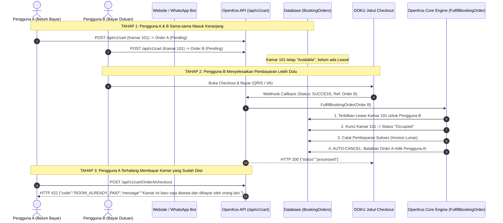

# Panduan Pemesanan Masuk Keranjang (Cart-First) & Pembuatan Sewa Otomatis Pasca Bayar (OpenKos)

Dokumen ini menjelaskan alur **Cart-First Room Booking & Deferred Lease Creation** di OpenKos, termasuk **Manajemen Konflik & Concurrency** (jika ada pengguna yang memesan kamar namun belum bayar, sementara pengguna lain telah menyelesaikan pembayaran lebih dulu).

---

## 1. Diagram Alur Lengkap (Cart-First Lifecycle)



---

## 2. Spesifikasi API Keranjang & Pemesanan

### 2.1 Menambahkan Kamar ke Keranjang (Add to Cart)
- **Method**: `POST`
- **URL**: `https://api.domain-anda.com/api/v1/cart`  
  *(Atau alias: `POST /api/v1/orders` / `POST /api/v1/bookings`)*
- **Headers**:
  ```http
  Content-Type: application/json
  Accept: application/json
  X-Cart-Token: <opsional-uuid-keranjang>
  ```

#### Request Body Parameters:
| Parameter | Tipe | Wajib? | Keterangan |
| :--- | :--- | :---: | :--- |
| `unit_id` | `integer` | **Ya** | ID kamar yang dipilih (dari `GET /api/v1/available-rooms`). |
| `name` | `string` | **Ya** | Nama lengkap calon penyewa. |
| `phone` | `string` | **Ya** | Nomor telepon WhatsApp (format: `"081234567890"` atau `"6281234567890"`). |
| `email` | `string` | Tidak | Alamat email calon penyewa (jika kosong, sistem fallback ke `phone@openkos.local`). |
| `start_date` | `date` | **Ya** | Tanggal mulai sewa / rencana check-in (`YYYY-MM-DD`). |
| `duration_months` | `integer` | Tidak | Durasi sewa dalam bulan (default: `1`). |
| `cart_token` | `string` | Tidak | Token keranjang dari browser / session bot. |
| `notes` | `string` | Tidak | Catatan tambahan. |

#### Contoh Response Sukses (`201 Created`):
```json
{
  "message": "Booking order created and saved in cart. Please complete payment to confirm your lease.",
  "order": {
    "id": 14,
    "reference": "BK-X8K2M9LP1Q",
    "cart_token": "a1b2c3d4-e5f6-7a8b-9c0d-1e2f3a4b5c6d",
    "status": "pending",
    "property": {
      "id": 1,
      "name": "Highlander Stay Grogol"
    },
    "unit": {
      "id": 5,
      "name": "Kamar 101"
    },
    "guest": {
      "name": "Budi Santoso",
      "phone": "6281299998888"
    },
    "amount": 1750000.0,
    "currency": "IDR",
    "checkout_url": "https://staging.doku.com/checkout-link-v2/9b7f9a12-xxxx-xxxx-xxxx",
    "expires_at": "2026-09-16T11:45:00+00:00",
    "lease_created": false
  }
}
```

---

### 2.2 Melihat Isi Keranjang (Dengan Indikator Ketersediaan Real-Time)
- **Method**: `GET`
- **URL**: `https://api.domain-anda.com/api/v1/cart?cart_token={cart_token}` *(atau `?phone={phone}`)*

#### Contoh Response:
```json
{
  "cart": {
    "cart_token": "a1b2c3d4-e5f6-7a8b-9c0d-1e2f3a4b5c6d",
    "count": 1,
    "total": 1750000.0,
    "items": [
      {
        "id": 14,
        "reference": "BK-X8K2M9LP1Q",
        "property_name": "Highlander Stay Grogol",
        "unit_name": "Kamar 101",
        "guest_name": "Budi Santoso",
        "amount": 1750000.0,
        "status": "pending",
        "is_available": true,
        "conflict_message": null,
        "checkout_url": "https://staging.doku.com/checkout-link-v2/9b7f9a12-xxxx",
        "expires_at": "2026-09-16T11:45:00+00:00"
      }
    ]
  }
}
```

> **Jika Kamar Telah Dibayar Oleh Orang Lain**:
> `is_available` bernilai `false`, dan `conflict_message` berisi:
> `"Kamar ini sudah terisi atau tidak tersedia lagi karena telah dibayar oleh pengguna lain."`

---

### 2.3 Checkout Guard (Pencegahan Sebelum Bayar)
Ketika pengguna mengklik tombol "Bayar" / Checkout:
- **Method**: `POST`
- **URL**: `https://api.domain-anda.com/api/v1/cart/{bookingOrderId}/checkout`

Jika kamar **sudah disewa & dibayar oleh orang lain**, sistem menolak dengan HTTP `422`:
```json
{
  "code": "ROOM_ALREADY_PAID",
  "message": "Maaf, kamar ini baru saja disewa dan dibayar oleh pengguna lain. Silakan pilih kamar lain yang masih tersedia."
}
```
Sistem juga secara otomatis memperbarui status pesanan tersebut menjadi `cancelled`.

---

## 3. Manajemen Konflik Pemesanan (First-Paid-First-Served)

Jika Pengguna A memesan kamar tetapi belum membayar, dan kemudian Pengguna B memesan kamar yang sama dan langsung membayar, sistem mengelolanya dengan **3 Lapis Perlindungan Otomatis**:

### Lapis 1: Pembatalan Otomatis Pesanan Pesaing (`Auto-Cancellation`)
Saat pembayaran Pengguna B terkonfirmasi oleh webhook DOKU:
1. Pengguna B resmi mendapatkan kontrak sewa (`Lease`), kamar berubah menjadi `Occupied`, dan pembayaran tercatat lunas.
2. OpenKos mengeksekusi query atomik untuk mencari seluruh `BookingOrder` lain yang masih berstatus `pending` untuk kamar tersebut:
   - Status otomatis diubah menjadi `cancelled`.
   - Kolom `notes` dicatat: `"Dibatalkan otomatis: Kamar telah dibayar oleh pengguna lain (Order BK-XXXXX)"`.
   - Pesanan tersebut otomatis hilang dari keranjang belanja aktif Pengguna A.

### Lapis 2: Pre-Checkout Availability Guard
Jika Pengguna A sedang membuka halaman pembayaran atau mencoba checkout ulang via endpoint `/cart/{id}/checkout`:
- Sistem mengecek apakah kamar masih `Available` dan kapasitas kamar belum penuh.
- Jika sudah `Occupied` atau kapasitas habis, permintaan ditolak dengan kode `ROOM_ALREADY_PAID`. Pengguna A terhindar dari salah transfer uang ke kamar yang sudah tidak tersedia.

### Lapis 3: Safety Net Kasus Ekstrem (Double Payment / Keduanya Sempat Bayar Bersamaan)
Skenario langka: Pengguna A dan Pengguna B sama-sama membuka halaman pembayaran bank/e-wallet dan mentransfer uang pada detik yang hampir bersamaan:
1. Pembayaran Pengguna B masuk pertama (pukul 10:00:00) -> Kontrak sewa Pengguna B resmi terbit.
2. Pembayaran Pengguna A masuk kedua (pukul 10:00:02) untuk kamar yang sama.
3. **Penanganan Sistem**:
   - `FulfillBookingOrder` mendeteksi bahwa kapasitas kamar telah penuh.
   - Status `BookingOrder` Pengguna A ditandai sebagai `payment_conflict`.
   - Timestamp `paid_at` dan nomor referensi DOKU tetap tersimpan rapi (uang tidak hilang tanpa jejak).
   - Log level `CRITICAL` dikirim ke tim operasional / admin kos:
     ```text
     DOUBLE BOOKING PAYMENT CONFLICT DETECTED!
     Order BK-AAA telah membayar Rp 1.750.000 via DOKU, namun Kamar 101 telah terisi oleh Order BK-BBB.
     Tindakan yang diperlukan: Hubungi penyewa untuk relokasi ke kamar setara atau proses refund.
     ```
   - Webhook mengembalikan `HTTP 200 {"status": "payment_conflict"}` sehingga DOKU tidak terjebak dalam perulangan pengiriman webhook gagal.

---

## 4. Struktur Status `BookingOrder`

| Status | Deskripsi |
| :--- | :--- |
| `pending` | Pesanan tersimpan di keranjang, kamar belum dikunci, menunggu pembayaran. |
| `paid` | Pembayaran berhasil diproses, kontrak sewa (`Lease`) aktif, kwitansi tagihan lunas. |
| `cancelled` | Dibatalkan oleh pengguna, atau dibatalkan otomatis karena kamar telah dibayar oleh penyewa lain. |
| `expired` | Melewati batas waktu pembayaran yang ditentukan. |
| `payment_conflict` | Uang berhasil masuk via gateway, namun kamar sudah penuh terisi oleh penyewa lain. Memerlukan penanganan admin (pindah kamar setara atau refund). |

---

## 5. Ringkasan Tanya Jawab

| Pertanyaan | Solusi Sistem |
| :--- | :--- |
| **User A booking tapi belum bayar, User B bayar duluan. Apa yang terjadi pada User A?** | Pesanan User A otomatis dibatalkan (`cancelled`). Jika User A mencoba checkout, sistem memblokir dengan pesan `"Maaf, kamar ini baru saja disewa dan dibayar oleh pengguna lain."` |
| **Kapan kamar berubah jadi occupied?** | Hanya ketika salah satu pengguna berhasil menyelesaikan pembayaran di DOKU. |
| **Bagaimana jika uang User A terlanjur terdebet karena bayar hampir bersamaan?** | Sistem mencatat transaksi dengan status `payment_conflict`, menyimpan bukti DOKU, dan memunculkan notifikasi agar admin dapat menawarkan kamar setara atau refund. |
