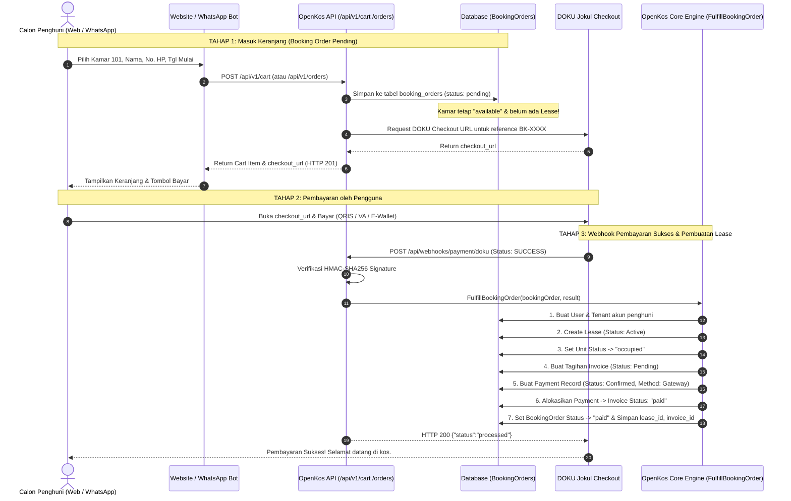

# Panduan Pemesanan Masuk Keranjang (Cart-First) & Pembuatan Sewa Otomatis Pasca Bayar (OpenKos)

Dokumen ini menjelaskan alur **Cart-First Room Booking & Deferred Lease Creation** di OpenKos:
1. **Penyimpanan ke Keranjang (Cart / Booking Order)**: Ketika calon penghuni memesan kamar melalui Website atau WhatsApp Bot, pesanan disimpan terlebih dahulu ke dalam sistem sebagai **Booking Order (Keranjang)** dengan status `pending`.
2. **Kamar Tetap Tersedia & Belum Dibuatkan Lease**: Pada tahap ini, kontrak sewa (**Lease**) **BELUM** dibuat, kamar **BELUM** berstatus `Occupied`, dan tagihan resmi **BELUM** diterbitkan.
3. **Pembayaran Melalui DOKU Checkout**: Sistem langsung membuatkan tautan pembayaran resmi DOKU untuk nomor referensi pesanan tersebut.
4. **Penerbitan Sewa & Kwitansi Otomatis (Saat Pembayaran Sukses)**: Begitu pembayaran dinyatakan berhasil oleh DOKU melalui webhook, OpenKos secara otomatis:
   - Membuat/menghubungkan akun **User & Tenant**.
   - Menerbitkan kontrak sewa aktif (**Lease**).
   - Mengubah status kamar menjadi **Occupied**.
   - Menerbitkan **Invoice** bulan pertama.
   - Mencatat record pembayaran sukses (**Payment**) dengan status `confirmed`.
   - Mengubah status **Invoice** menjadi **Paid (Lunas)**.
   - Memperbarui status **Booking Order** menjadi **Paid**.

---

## 1. Diagram Alur Lengkap (Cart-First Lifecycle)



---

## 2. Spesifikasi API Keranjang & Pemesanan

### 2.1 Menambahkan Kamar ke Keranjang (Add to Cart / Create Booking Order)
- **Method**: `POST`
- **URL**: `https://api.domain-anda.com/api/v1/cart`  
  *(Atau alias: `POST /api/v1/orders` / `POST /api/v1/bookings`)*
- **Headers**:
  ```http
  Content-Type: application/json
  Accept: application/json
  X-Cart-Token: <opsional-uuid-keranjang>
  ```

#### Request Body Parameters:
| Parameter | Tipe | Wajib? | Keterangan |
| :--- | :--- | :---: | :--- |
| `unit_id` | `integer` | **Ya** | ID kamar yang dipilih (dari `GET /api/v1/available-rooms`). |
| `name` | `string` | **Ya** | Nama lengkap calon penyewa. |
| `phone` | `string` | **Ya** | Nomor telepon WhatsApp (format: `"081234567890"` atau `"6281234567890"`). |
| `email` | `string` | Tidak | Alamat email calon penyewa. |
| `start_date` | `date` | **Ya** | Tanggal mulai sewa / rencana check-in (`YYYY-MM-DD`). |
| `duration_months` | `integer` | Tidak | Durasi sewa dalam bulan (default: `1`, min: `1`, max: `60`). |
| `cart_token` | `string` | Tidak | Token keranjang dari browser / session bot. Jika tidak dikirim, sistem otomatis membuatkan UUID baru. |
| `notes` | `string` | Tidak | Catatan tambahan. |

#### Contoh Request:
```json
{
  "unit_id": 5,
  "name": "Budi Santoso",
  "phone": "081299998888",
  "email": "budi.santoso@example.com",
  "start_date": "2026-10-01",
  "duration_months": 1,
  "notes": "Booking kamar dari website"
}
```

#### Contoh Response Sukses (`201 Created`):
```json
{
  "message": "Booking order created and saved in cart. Please complete payment to confirm your lease.",
  "order": {
    "id": 14,
    "reference": "BK-X8K2M9LP1Q",
    "cart_token": "a1b2c3d4-e5f6-7a8b-9c0d-1e2f3a4b5c6d",
    "status": "pending",
    "property": {
      "id": 1,
      "name": "Highlander Stay Grogol",
      "address": "Jl. Alpukat No. 12, Jakarta Barat"
    },
    "unit": {
      "id": 5,
      "name": "Kamar 101"
    },
    "guest": {
      "name": "Budi Santoso",
      "phone": "6281299998888",
      "email": "budi.santoso@example.com"
    },
    "period": {
      "start_date": "2026-10-01",
      "end_date": "2026-11-01",
      "duration_months": 1
    },
    "amount": 1750000.0,
    "currency": "IDR",
    "checkout_url": "https://staging.doku.com/checkout-link-v2/9b7f9a12-xxxx-xxxx-xxxx",
    "expires_at": "2026-09-16T11:45:00+00:00",
    "lease_created": false
  }
}
```

> **Catatan Penting**:
> - `order.lease_created = false`: Menandakan sewa belum dibuat sebelum pembayaran berhasil.
> - Kamar nomor 101 tetap berstatus `available` bagi pencarian publik.
> - `order.checkout_url`: Tautan resmi DOKU untuk langsung melakukan pembayaran.

---

### 2.2 Melihat Isi Keranjang (View Cart)
- **Method**: `GET`
- **URL**: `https://api.domain-anda.com/api/v1/cart?cart_token={cart_token}`  
  *(Atau melalui query `?phone=081299998888` atau header `X-Cart-Token`)*

#### Contoh Response (`200 OK`):
```json
{
  "cart": {
    "cart_token": "a1b2c3d4-e5f6-7a8b-9c0d-1e2f3a4b5c6d",
    "count": 1,
    "total": 1750000.0,
    "items": [
      {
        "id": 14,
        "reference": "BK-X8K2M9LP1Q",
        "property_name": "Highlander Stay Grogol",
        "unit_name": "Kamar 101",
        "guest_name": "Budi Santoso",
        "guest_phone": "6281299998888",
        "start_date": "2026-10-01",
        "end_date": "2026-11-01",
        "duration_months": 1,
        "amount": 1750000.0,
        "currency": "IDR",
        "status": "pending",
        "checkout_url": "https://staging.doku.com/checkout-link-v2/9b7f9a12-xxxx-xxxx-xxxx",
        "expires_at": "2026-09-16T11:45:00+00:00"
      }
    ]
  }
}
```

---

### 2.3 Menghapus Item dari Keranjang (Remove Item / Cancel)
- **Method**: `DELETE`
- **URL**: `https://api.domain-anda.com/api/v1/cart/{bookingOrderId}`

#### Contoh Response (`200 OK`):
```json
{
  "message": "Booking item removed from cart."
}
```

---

### 2.4 Memperbarui Link Checkout Keranjang (Refresh Checkout URL)
Jika tautan pembayaran kedaluwarsa atau pengguna ingin membuka ulang halaman DOKU:
- **Method**: `POST`
- **URL**: `https://api.domain-anda.com/api/v1/cart/{bookingOrderId}/checkout`

#### Contoh Response (`200 OK`):
```json
{
  "message": "Checkout URL generated successfully.",
  "checkout_url": "https://staging.doku.com/checkout-link-v2/fresh-token-xxx",
  "order": {
    "id": 14,
    "reference": "BK-X8K2M9LP1Q",
    "amount": 1750000.0,
    "status": "pending"
  }
}
```

---

## 3. Eksekusi Otomatis Saat Pembayaran Sukses (Webhook DOKU)

Saat pengguna menyelesaikan transaksi via QRIS, Virtual Account, atau E-Wallet:

### 1. DOKU Mengirimkan Webhook ke OpenKos
- **URL Webhook**: `POST https://api.domain-anda.com/api/webhooks/payment/doku`
- Payload transaksi memiliki status `SUCCESS` dan invoice number yang merujuk pada `order.reference` (contoh: `BK-X8K2M9LP1Q`).

### 2. Verifikasi & Fulfillment (`FulfillBookingOrder`)
OpenKos mengenali referensi `BK-xxxx` dari tabel `booking_orders` dan menjalankan transaksi database atomik:
1. **User & Tenant**: Membuat akun penyewa otomatis jika belum terdaftar.
2. **Lease**: Menjalankan aksi `CreateLease`:
   - Unit status diubah menjadi **Occupied**.
   - Masa sewa aktif diikat ke tenant.
   - Tagihan pertama dibuat di tabel `invoices`.
3. **Payment Record**:
   - Dibuatkan record di tabel `payment_attempts` dengan status `settled`.
   - Dibuatkan record di tabel `payments` dengan nominal lunas, status `confirmed`, dan metode `gateway`.
   - Menjalankan `AllocatePayment` sehingga status tagihan di tabel `invoices` berubah menjadi `paid` dan `amount_paid` terisi penuh.
4. **Booking Order**:
   - Status diubah menjadi `paid`.
   - Field `lease_id`, `invoice_id`, dan `paid_at` diisi secara otomatis.

---

## 4. Struktur Database `booking_orders`

| Kolom | Tipe | Deskripsi |
| :--- | :--- | :--- |
| `id` | `BIGINT UNSIGNED` | Primary Key. |
| `cart_token` | `VARCHAR(100)` | Token identitas sesi keranjang browser/bot. |
| `reference` | `VARCHAR(50)` | Nomor referensi unik (contoh: `BK-XXXXXXXXXX`). |
| `unit_id` | `BIGINT UNSIGNED` | ID kamar yang dipesan. |
| `tenant_id` | `BIGINT UNSIGNED (Nullable)` | ID penyewa (diisi otomatis saat pembayaran sukses). |
| `guest_name` | `VARCHAR(255)` | Nama calon penyewa. |
| `guest_phone` | `VARCHAR(30)` | Nomor HP WhatsApp. |
| `guest_email` | `VARCHAR(255)` | Email calon penyewa. |
| `start_date` | `DATE` | Tanggal mulai tinggal. |
| `end_date` | `DATE` | Tanggal berakhir sewa periode pertama. |
| `duration_months` | `INT` | Durasi bulan yang dipesan. |
| `amount` | `DECIMAL(12,2)` | Nominal sewa yang harus dibayar. |
| `currency` | `VARCHAR(3)` | Mata uang (`IDR`). |
| `status` | `VARCHAR(20)` | Status order (`pending`, `paid`, `cancelled`, `expired`). |
| `lease_id` | `BIGINT UNSIGNED (Nullable)` | ID kontrak sewa setelah sukses bayar. |
| `invoice_id` | `BIGINT UNSIGNED (Nullable)` | ID tagihan yang terbit dan telah lunas. |
| `doku_checkout_url` | `TEXT` | URL sesi checkout DOKU. |
| `paid_at` | `TIMESTAMP` | Waktu pembayaran terkonfirmasi. |

---

## 5. Ringkasan Tanya Jawab

| Pertanyaan | Jawaban Teknis |
| :--- | :--- |
| **Apakah sebelum bayar kamar sudah terkunci (occupied)?** | **Tidak**. Kamar tetap `available` dan belum ada `Lease` yang dibuat. |
| **Kapan Lease dan Invoice terbit?** | Tepat pada saat DOKU mengirimkan notifikasi callback webhook dengan status `SUCCESS`. |
| **Apakah otomatis tercatat pembayaran sukses?** | **Ya**. Tabel `payments` terisi dengan status `confirmed`, `amount_paid` diisi pada tagihan, dan status invoice menjadi `paid`. |
| **Bagaimana jika calon penghuni membatalkan dari keranjang?** | Cukup panggil `DELETE /api/v1/cart/{id}`, status order diupdate menjadi `cancelled`. |
