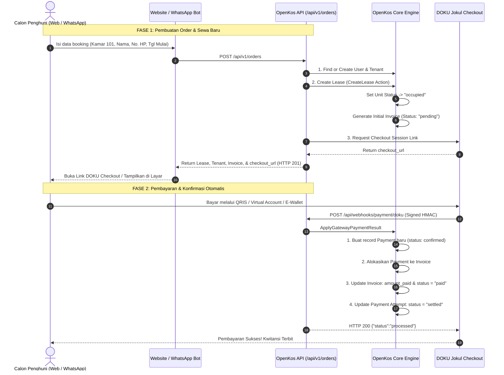

# Panduan Pembuatan Order/Sewa Baru & Siklus Pembayaran Sukses (OpenKos)

Dokumen ini menjawab dan mendokumentasikan alur lengkap:
1. **Pembuatan Order/Sewa**: Bagaimana order dari Website atau WhatsApp Bot secara otomatis membuat akun **Tenant**, menerbitkan kontrak sewa (**Lease**), mengunci kamar (**Occupied**), dan menerbitkan tagihan (**Invoice**).
2. **Pencatatan Pembayaran Sukses**: Bagaimana sistem secara otomatis mencatat data pembayaran sukses (**Payment**) dan mengubah status tagihan menjadi **Lunas (Paid)** setelah pembayaran diproses oleh payment gateway (DOKU Checkout).

---

## 1. Ringkasan Jawaban

| Pertanyaan | Status | Penjelasan Singkat |
| :--- | :---: | :--- |
| **Apakah ada API untuk membuat order yang otomatis membuat Lease dengan data tenant?** | ✅ **SUDAH DIBUAT** | Endpoint `POST /api/v1/orders` (atau alias `POST /api/v1/bookings`) menerima data calon penghuni dan kamar, membuat `Tenant` & `User`, membuat `Lease`, mengupdate status kamar menjadi `occupied`, menerbitkan `Invoice` pertama, dan langsung mengembalikan link pembayaran DOKU (`checkout_url`). |
| **Jika pembayaran diproses, apakah otomatis membuat data pembayaran sukses (success payment)?** | ✅ **SUDAH DIBUAT** | Webhook DOKU di `POST /api/webhooks/payment/doku` memverifikasi signature transaksi. Saat pembayaran sukses, OpenKos otomatis membuat record di tabel `payments` (`status: confirmed`), mengalokasikan pembayaran, dan mengubah status invoice menjadi `Paid`. |

---

## 2. Diagram Alur Lengkap (End-to-End Lifecycle)



---

## 3. Spesifikasi API: Pembuatan Order & Sewa Baru

### Endpoint
- **Method**: `POST`
- **URL**: `https://api.domain-anda.com/api/v1/orders`  
  *(Alias: `https://api.domain-anda.com/api/v1/bookings`)*
- **Headers**:
  ```http
  Content-Type: application/json
  Accept: application/json
  ```
  *(Endpoint ini bersifat publik, calon penghuni baru tidak diwajibkan menyertakan Bearer token).*

---

### Request Body Parameters

| Parameter | Tipe | Wajib? | Keterangan |
| :--- | :--- | :---: | :--- |
| `unit_id` | `integer` | **Ya** | ID kamar yang dipilih (dari `GET /api/v1/available-rooms`). |
| `name` | `string` | **Ya** | Nama lengkap penyewa (misal: `"Budi Santoso"`). |
| `phone` | `string` | **Ya** | Nomor telepon WhatsApp (format: `"081234567890"` atau `"6281234567890"`). |
| `email` | `string` | Tidak | Email penyewa (misal: `"budi@example.com"`). |
| `start_date` | `date` | **Ya** | Tanggal mulai sewa / check-in (format: `YYYY-MM-DD`). |
| `duration_months` | `integer` | Tidak | Durasi sewa dalam bulan (default: `1`, min: `1`, max: `60`). |
| `notes` | `string` | Tidak | Catatan tambahan penyewa. |

#### Contoh Request Body (JSON):
```json
{
  "unit_id": 12,
  "name": "Budi Santoso",
  "phone": "081299998888",
  "email": "budi.santoso@example.com",
  "start_date": "2026-10-01",
  "duration_months": 1,
  "notes": "Booking dari website"
}
```

---

### Response Sukses (`201 Created`)

```json
{
  "message": "Order created successfully. Lease and invoice have been generated.",
  "order": {
    "lease_id": 45,
    "lease_reference": "LSX20260045",
    "property": {
      "id": 2,
      "name": "Highlander Stay Grogol",
      "address": "Jl. Alpukat No. 12, Jakarta Barat"
    },
    "unit": {
      "id": 12,
      "name": "Kamar 204"
    },
    "period": {
      "start_date": "2026-10-01",
      "end_date": "2026-11-01",
      "duration_months": 1
    },
    "tenant": {
      "id": 19,
      "name": "Budi Santoso",
      "phone": "6281299998888",
      "email": "budi.santoso@example.com"
    },
    "invoice": {
      "id": 89,
      "reference": "INV20260089",
      "status": "pending",
      "total": 1500000.0,
      "due_date": "2026-10-01"
    },
    "checkout_url": "https://staging.doku.com/checkout-link-v2/9b7f9a12-xxxx-xxxx-xxxx",
    "payment_attempt": {
      "id": 34,
      "reference": "25fbbdae-3dbb-4fc6-b816-16010d8a9563",
      "amount": 1500000.0,
      "status": "pending",
      "expires_at": "2026-09-16T10:45:00+00:00"
    },
    "token": "1|sanctum_token_string_..."
  }
}
```

> **Penjelasan Field Response**:
> - `order.lease_id`: ID sewa resmi yang telah tercatat di OpenKos.
> - `order.invoice`: Tagihan sewa bulan pertama dengan nominal sewa kamar.
> - `order.checkout_url`: Link pembayaran resmi DOKU. Arahkan pengguna ke URL ini untuk membayar via QRIS, VA, atau E-Wallet.
> - `order.token`: Token Sanctum yang siap disimpan di local storage website/aplikasi agar penghuni langsung berstatus login.

---

### Penanganan Error (Validasi & Status Kamar)

| Kode HTTP | Respon | Solusi |
| :--- | :--- | :--- |
| **`422 Unprocessable Content`** | `{"message": "This room is currently under maintenance or unavailable for booking."}` | Kamar berstatus *Maintenance* atau *Unavailable*. Pilih kamar lain dari daftar kamar tersedia. |
| **`422 Unprocessable Content`** | `{"message": "This tenant already has an active lease. Please contact management."}` | Nomor HP tersebut sudah terdaftar dan masih memiliki sewa kamar aktif yang sedang berjalan. |
| **`404 Not Found`** | `{"message": "No query results for model [Unit]..."}` | ID Kamar (`unit_id`) tidak ditemukan dalam database. |

---

## 4. Siklus Pembayaran Sukses (Success Payment)

Ketika penghuni menyelesaikan pembayaran di DOKU Checkout, tahapan berikut berjalan **100% otomatis** di latar belakang:

### 1. Penerimaan Webhook DOKU
- DOKU mengirimkan HTTP `POST` ke endpoint:
  ```http
  POST /api/webhooks/payment/doku
  ```
- Header HTTP memuat `Client-Id`, `Request-Id`, `Request-Timestamp`, dan `Signature` (HMAC-SHA256).
- OpenKos memverifikasi signature menggunakan `DOKU_SECRET_KEY`. Jika valid, webhook diproses.

### 2. Pembuatan Data Pembayaran Sukses di Database OpenKos
Sistem mengeksekusi pipeline pencatatan transaksi:
1. **Tabel `payments`**:
   - Dibuat baris data baru dengan nominal yang dibayar.
   - `payment_method` diset menjadi `'gateway'`.
   - `status` diset menjadi `'confirmed'`.
   - `reference_number` dicatat sesuai referensi sesi DOKU.
   - `verified_at` diisi timestamp saat transaksi terjadi.
2. **Tabel `payment_allocations`**:
   - Dibuat relasi alokasi dana antara baris `payments` dan baris `invoices`.
3. **Tabel `invoices`**:
   - `amount_paid` bertambah sesuai jumlah uang yang dibayarkan.
   - `status` otomatis berubah dari `'pending'` menjadi `'paid'`.
4. **Tabel `payment_attempts`**:
   - `status` berubah dari `'pending'` menjadi `'settled'`.
   - `settled_at` tercatat.

---

## 5. Contoh Kode Frontend: Pemesanan & Pembayaran (React / Next.js)

```tsx
import React, { useState } from 'react';
import axios from 'axios';

interface BookingFormData {
  unitId: number;
  unitName: string;
  price: number;
}

export function RoomBookingForm({ unitId, unitName, price }: BookingFormData) {
  const [name, setName] = useState('');
  const [phone, setPhone] = useState('');
  const [email, setEmail] = useState('');
  const [startDate, setStartDate] = useState('');
  const [loading, setLoading] = useState(false);
  const [error, setError] = useState<string | null>(null);

  const handleSubmit = async (e: React.FormEvent) => {
    e.preventDefault();
    setLoading(true);
    setError(null);

    try {
      // 1. Kirim order booking ke OpenKos API
      const response = await axios.post('https://api.domain-anda.com/api/v1/orders', {
        unit_id: unitId,
        name: name,
        phone: phone,
        email: email || undefined,
        start_date: startDate,
        duration_months: 1,
      });

      const { checkout_url, token } = response.data.order;

      // 2. Simpan token otentikasi penghuni di local storage
      if (token) {
        localStorage.setItem('tenant_token', token);
      }

      // 3. Arahkan penghuni langsung ke DOKU Checkout untuk membayar
      if (checkout_url) {
        window.location.href = checkout_url;
      } else {
        alert('Sewa berhasil dibuat! Silakan hubungi admin untuk pembayaran.');
      }
    } catch (err: any) {
      setError(err.response?.data?.message || 'Gagal memproses pesanan.');
      setLoading(false);
    }
  };

  return (
    <form onSubmit={handleSubmit} className="p-6 bg-white rounded-xl shadow-md max-w-md">
      <h2 className="text-xl font-bold mb-4">Sewa {unitName}</h2>
      <p className="text-gray-600 mb-4">Harga: Rp {price.toLocaleString('id-ID')} / bulan</p>

      {error && <div className="p-3 mb-4 text-sm bg-red-50 text-red-700 rounded-lg">{error}</div>}

      <div className="space-y-3">
        <div>
          <label className="block text-sm font-medium text-gray-700">Nama Lengkap</label>
          <input
            type="text"
            required
            value={name}
            onChange={(e) => setName(e.target.value)}
            className="w-full border rounded-lg p-2.5 mt-1"
            placeholder="Contoh: Budi Santoso"
          />
        </div>

        <div>
          <label className="block text-sm font-medium text-gray-700">Nomor WhatsApp</label>
          <input
            type="tel"
            required
            value={phone}
            onChange={(e) => setPhone(e.target.value)}
            className="w-full border rounded-lg p-2.5 mt-1"
            placeholder="Contoh: 081234567890"
          />
        </div>

        <div>
          <label className="block text-sm font-medium text-gray-700">Email (Opsional)</label>
          <input
            type="email"
            value={email}
            onChange={(e) => setEmail(e.target.value)}
            className="w-full border rounded-lg p-2.5 mt-1"
            placeholder="budi@example.com"
          />
        </div>

        <div>
          <label className="block text-sm font-medium text-gray-700">Tanggal Mulai Sewa</label>
          <input
            type="date"
            required
            value={startDate}
            onChange={(e) => setStartDate(e.target.value)}
            className="w-full border rounded-lg p-2.5 mt-1"
          />
        </div>

        <button
          type="submit"
          disabled={loading}
          className="w-full mt-4 bg-indigo-600 text-white font-semibold py-3 px-4 rounded-lg hover:bg-indigo-700 disabled:opacity-50"
        >
          {loading ? 'Memproses Sewa & Link Bayar...' : 'Lanjut ke Pembayaran (DOKU)'}
        </button>
      </div>
    </form>
  );
}
```

---

## 6. Contoh Alur di WhatsApp Bot (Node.js / Baileys / WABA)

Ketika calon penghuni menyetujui booking kamar di WhatsApp:
1. Bot menanyakan: Nama, Nomor HP (dari sender), Tanggal check-in.
2. Bot memanggil `POST /api/v1/orders`.
3. Bot langsung membalas dengan link DOKU Checkout:
   ```text
   Selamat Kak *Budi Santoso*! 🎉
   Pesanan sewa kamar Anda berhasil dibuat:

   🏠 Properti: Highlander Stay Grogol
   🚪 Kamar: Kamar 101
   📅 Tanggal Mulai: 01 Oktober 2026
   💰 Tagihan Sewa: Rp 1.750.000

   Silakan selesaikan pembayaran melalui tautan DOKU di bawah ini:
   👉 https://staging.doku.com/checkout-link-v2/xxxxxxxxx

   (Bisa bayar via QRIS, BCA VA, Mandiri VA, BRI VA, OVO, ShopeePay, dll.)

   Setelah pembayaran selesai, kamar akan resmi terkunci untuk Anda secara otomatis.
   ```
