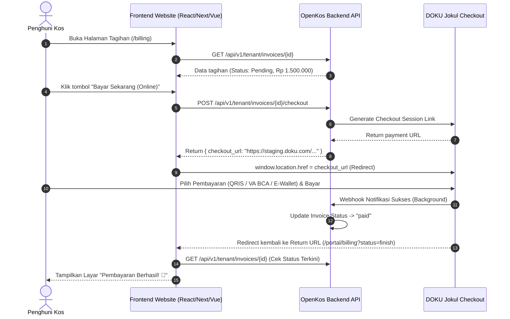

# Panduan Integrasi Pembayaran DOKU untuk Website & Portal Penghuni (OpenKos)

Dokumentasi ini ditujukan bagi pengembang frontend (React, Next.js, Vue, Nuxt, Svelte, atau HTML/JS) yang membangun **Website Penghuni (Tenant Portal)** atau **Aplikasi Web Kos** yang terhubung ke backend OpenKos dan payment gateway **DOKU Checkout (Jokul)**.

---

## 1. Arsitektur & Alur Pengguna (User Flow)

Metode yang direkomendasikan adalah **Hosted Checkout Redirect**, di mana pengguna diarahkan ke halaman pembayaran aman DOKU yang telah dioptimalkan untuk perangkat mobile dan desktop.



---

## 2. Endpoint API OpenKos yang Digunakan

Semua request dari website tenant wajib menyertakan header:
```http
Authorization: Bearer <tenant_sanctum_token>
Accept: application/json
```

### 2.1 Mengambil Detail Tagihan
- **Method**: `GET`
- **URL**: `/api/v1/tenant/invoices/{id}`
- **Fungsi**: Memeriksa status tagihan (`pending`, `partial`, `paid`) dan nominal yang harus dibayar.

### 2.2 Membuat Sesi Pembayaran DOKU
- **Method**: `POST`
- **URL**: `/api/v1/tenant/invoices/{id}/checkout`
- **Fungsi**: Membuat link checkout DOKU instan.

#### Contoh Response (`200 OK`):
```json
{
  "message": "Checkout session created successfully.",
  "checkout_url": "https://staging.doku.com/checkout-link-v2/9b7f9a12-xxxx-xxxx-xxxx",
  "reused": false,
  "attempt": {
    "id": 18,
    "reference": "d290f1ee-6c54-4b01-90e6-d701748f0851",
    "provider_reference": "d290f1ee-6c54-4b01-90e6-d701748f0851",
    "amount": 1500000,
    "currency": "IDR",
    "status": "pending",
    "expires_at": "2026-09-16T10:30:00+00:00"
  }
}
```

---

## 3. Implementasi Frontend

### A. Contoh Komponen React / Next.js (TypeScript + Tailwind CSS)

Berikut adalah komponen tagihan lengkap dengan tombol bayar online, status loading, dan penanganan error:

```tsx
import React, { useState } from 'react';
import axios from 'axios';

interface InvoiceProps {
  invoice: {
    id: number;
    reference: string;
    total: number;
    amount_paid: number;
    outstanding: number;
    status: 'pending' | 'partial' | 'paid';
    due_date: string;
    unit_name?: string;
  };
  token: string;
  apiBaseUrl: string;
}

export const InvoiceCard: React.FC<InvoiceProps> = ({ invoice, token, apiBaseUrl }) => {
  const [loading, setLoading] = useState<boolean>(false);
  const [errorMessage, setErrorMessage] = useState<string | null>(null);

  const handleOnlinePayment = async () => {
    setLoading(true);
    setErrorMessage(null);

    try {
      const response = await axios.post(
        `${apiBaseUrl}/api/v1/tenant/invoices/${invoice.id}/checkout`,
        {},
        {
          headers: {
            Authorization: `Bearer ${token}`,
            Accept: 'application/json',
          },
        }
      );

      const checkoutUrl = response.data?.checkout_url;

      if (checkoutUrl) {
        // Arahkan penghuni ke halaman DOKU Checkout
        window.location.href = checkoutUrl;
      } else {
        throw new Error('Link pembayaran tidak ditemukan dalam respon server.');
      }
    } catch (err: any) {
      const msg =
        err.response?.data?.message ||
        err.message ||
        'Gagal memulai pembayaran online. Silakan coba lagi nanti.';
      setErrorMessage(msg);
      setLoading(false);
    }
  };

  const isPaid = invoice.status === 'paid' || invoice.outstanding <= 0;

  return (
    <div className="bg-white rounded-2xl border border-gray-100 shadow-sm p-6 max-w-md w-full">
      <div className="flex justify-between items-start mb-4">
        <div>
          <span className="text-xs font-semibold uppercase tracking-wider text-gray-400">
            Tagihan Sewa
          </span>
          <h3 className="text-lg font-bold text-gray-900">{invoice.reference}</h3>
          {invoice.unit_name && (
            <p className="text-sm text-gray-500 mt-0.5">{invoice.unit_name}</p>
          )}
        </div>
        <span
          className={`px-3 py-1 rounded-full text-xs font-medium ${
            isPaid
              ? 'bg-emerald-50 text-emerald-700 border border-emerald-200'
              : 'bg-amber-50 text-amber-700 border border-amber-200'
          }`}
        >
          {isPaid ? 'Lunas' : 'Belum Lunas'}
        </span>
      </div>

      <div className="border-t border-b border-gray-100 py-3 my-4 space-y-2 text-sm">
        <div className="flex justify-between text-gray-600">
          <span>Jatuh Tempo</span>
          <span className="font-medium text-gray-900">{invoice.due_date}</span>
        </div>
        <div className="flex justify-between text-gray-600">
          <span>Total Tagihan</span>
          <span className="font-medium text-gray-900">
            Rp {Number(invoice.total).toLocaleString('id-ID')}
          </span>
        </div>
        <div className="flex justify-between text-base font-bold text-gray-900 pt-1">
          <span>Sisa Pembayaran</span>
          <span className="text-indigo-600">
            Rp {Number(invoice.outstanding).toLocaleString('id-ID')}
          </span>
        </div>
      </div>

      {errorMessage && (
        <div className="p-3 mb-4 text-xs text-rose-700 bg-rose-50 border border-rose-200 rounded-lg">
          {errorMessage}
        </div>
      )}

      {!isPaid ? (
        <button
          onClick={handleOnlinePayment}
          disabled={loading}
          className="w-full flex items-center justify-center gap-2 py-3 px-4 rounded-xl bg-indigo-600 hover:bg-indigo-700 text-white font-semibold text-sm transition-colors shadow-sm disabled:opacity-50 disabled:cursor-not-allowed"
        >
          {loading ? (
            <>
              <svg className="animate-spin h-4 w-4 text-white" viewBox="0 0 24 24">
                <circle
                  className="opacity-25"
                  cx="12"
                  cy="12"
                  r="10"
                  stroke="currentColor"
                  strokeWidth="4"
                  fill="none"
                />
                <path
                  className="opacity-75"
                  fill="currentColor"
                  d="M4 12a8 8 0 018-8v8H4z"
                />
              </svg>
              <span>Mempersiapkan Pembayaran...</span>
            </>
          ) : (
            <>
              <span>Bayar Sekarang (QRIS / VA / E-Wallet)</span>
              <svg className="w-4 h-4" fill="none" stroke="currentColor" viewBox="0 0 24 24">
                <path strokeLinecap="round" strokeLinejoin="round" strokeWidth="2" d="M9 5l7 7-7 7" />
              </svg>
            </>
          )}
        </button>
      ) : (
        <div className="text-center py-2 text-sm text-emerald-600 font-medium">
          ✓ Tagihan ini telah selesai dibayar
        </div>
      )}
    </div>
  );
};
```

---

### B. Contoh Implementasi HTML & Vanilla JavaScript

Cocok untuk landing page sederhana atau integrasi cepat:

```html
<!DOCTYPE html>
<html lang="id">
<head>
  <meta charset="UTF-8">
  <title>Bayar Tagihan Kos</title>
  <script src="https://cdn.jsdelivr.net/npm/axios/dist/axios.min.js"></script>
</head>
<body style="font-family: sans-serif; padding: 40px; background: #f8fafc;">

  <div style="background: white; max-width: 400px; padding: 24px; border-radius: 12px; box-shadow: 0 4px 6px -1px rgba(0,0,0,0.1);">
    <h2>Tagihan Sewa Kamar</h2>
    <p>Total: <strong>Rp 1.500.000</strong></p>
    
    <button id="pay-button" style="background: #4f46e5; color: white; border: none; padding: 12px 20px; border-radius: 8px; cursor: pointer; font-weight: bold; width: 100%;">
      Bayar via DOKU
    </button>
    
    <p id="status-msg" style="margin-top: 12px; font-size: 14px; color: #dc2626;"></p>
  </div>

  <script>
    const API_BASE = 'https://dashboard.highlanderstay.com';
    const INVOICE_ID = 89; // Disesuaikan dengan id invoice
    const TOKEN = 'TOKEN_SANCTUM_PENGHUNI';

    document.getElementById('pay-button').addEventListener('click', async () => {
      const btn = document.getElementById('pay-button');
      const msg = document.getElementById('status-msg');

      btn.disabled = true;
      btn.innerText = 'Memuat DOKU Checkout...';
      msg.innerText = '';

      try {
        const response = await axios.post(`${API_BASE}/api/v1/tenant/invoices/${INVOICE_ID}/checkout`, {}, {
          headers: {
            'Authorization': `Bearer ${TOKEN}`,
            'Accept': 'application/json'
          }
        });

        if (response.data && response.data.checkout_url) {
          window.location.href = response.data.checkout_url;
        } else {
          throw new Error('Gagal mendapatkan URL checkout');
        }
      } catch (err) {
        msg.innerText = err.response?.data?.message || err.message;
        btn.disabled = false;
        btn.innerText = 'Bayar via DOKU';
      }
    });
  </script>
</body>
</html>
```

---

## 4. Return URL & Verifikasi Status Pembayaran

Ketika penghuni selesai membayar atau menutup halaman DOKU, DOKU akan mengarahkan kembali peramban ke **Callback URL** yang Anda konfigurasikan di `.env`:

```env
DOKU_CALLBACK_URL=https://website-anda.com/portal/billing
```

### Rekomendasi Alur di Halaman Return (`/portal/billing`):
1. Saat komponen halaman dimuat, panggil `GET /api/v1/tenant/invoices/{id}`.
2. Jika status telah berubah menjadi `paid`:
   - Tampilkan animasi konfirmasi / modal: *"Terima kasih! Pembayaran Anda sebesar Rp X telah berhasil diverifikasi."*
3. Jika status masih `pending` (misal transfer VA tertunda atau belum dibayar):
   - Tampilkan informasi: *"Menunggu Pembayaran. Silakan selesaikan pembayaran sebelum batas waktu berakhir."*

---

## 5. Pengujian di Lingkungan Sandbox DOKU

Untuk mencoba pembayaran tanpa uang asli:
1. Pastikan `DOKU_ENVIRONMENT=sandbox` di backend `.env`.
2. Klik tombol bayar untuk masuk ke halaman `staging.doku.com`.
3. Pilih metode pembayaran:
   - **BCA / Mandiri / BRI Virtual Account**: Salin nomor VA yang muncul di layar.
   - Gunakan **DOKU Simulator** di portal Jokul Sandbox (`https://sandbox.doku.com`) untuk mensimulasikan pembayaran sukses.
   - **QRIS**: Scan menggunakan simulator DOKU atau tekan tombol simulasi sukses.
4. Dalam beberapa detik, webhook OpenKos akan menerima data dari DOKU dan mengubah status invoice menjadi **Paid**.

---

## 6. Checklist Keamanan & Produksi

- [x] **Jangan pernah mengekspos `DOKU_SECRET_KEY` di kode frontend**. Signature generation dilakukan 100% di backend OpenKos.
- [x] **Gunakan protokol HTTPS** untuk domain backend dan website agar webhook DOKU dapat diterima dengan aman.
- [x] **Pastikan URL Webhook terdaftar di Dashboard DOKU**: `https://api.domain-anda.com/api/webhooks/payment/doku`.
- [x] **Idempoten**: Jika penghuni mengklik tombol bayar dua kali, OpenKos secara cerdas mengembalikan sesi pembayaran aktif yang belum kadaluarsa (`reused: true`) tanpa menduplikasi tagihan.
