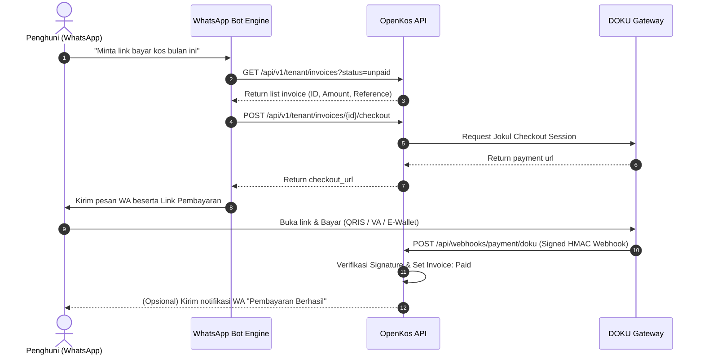

# Panduan Integrasi Pembayaran DOKU untuk WhatsApp Bot (OpenKos)

Dokumentasi ini menjelaskan langkah-langkah teknis untuk mengintegrasikan layanan **DOKU Checkout (Jokul)** ke dalam sistem **WhatsApp Bot** (misalnya bot berbasis Node.js/Baileys, Python, n8n, Fonnte, atau WhatsApp Cloud API).

Dengan integrasi ini, tenant dapat meminta link pembayaran secara instan di WhatsApp, membuka halaman pembayaran resmi DOKU untuk membayar melalui **QRIS, Virtual Account (BCA, Mandiri, BRI, BNI, Permata), E-Wallet (OVO, ShopeePay), atau Minimarket**, dan menerima bukti pembayaran lunas secara otomatis tanpa perlu konfirmasi manual.

---

## 1. Arsitektur & Alur Kerja (Flow)



---

## 2. Persiapan & Kredensial

Pastikan sistem OpenKos telah terkonfigurasi dengan kredensial DOKU Sandbox/Production di `.env`:

```env
DOKU_CLIENT_ID=BRN-0208-1788852244810
DOKU_SECRET_KEY=SK-vkKdx1b9ZOLoYiyeMuqz
DOKU_API_KEY=doku_key_sandbox_11f95366b305485d8e9de31f9399cc8e
DOKU_ENVIRONMENT=sandbox
DOKU_CALLBACK_URL=https://dashboard.highlanderstay.com/portal/billing
```

URL Webhook DOKU yang harus didaftarkan di Jokul Back Office / Merchant Dashboard:
- **Notification URL**: `https://api.domain-anda.com/api/webhooks/payment/doku`

---

## 3. Tahapan Integrasi pada Bot

### Langkah 1: Otentikasi Bot ke OpenKos API
Bot melakukan request menggunakan **Bearer Token (Sanctum)** milik akun tenant atau akun sistem/admin bot.

> **Tips Identifikasi Nomor HP**:
> Jika bot menerima pesan dari nomor `628123456789`, bot dapat login atau memvalidasi akun tenant menggunakan endpoint login nomor telepon:
> `POST /api/v1/auth/login` dengan `{ "login": "08123456789", "password": "..." }` atau menggunakan token Sanctum statis yang telah digenerate untuk Bot Integrator.

---

### Langkah 2: Mengambil Tagihan Belum Lunas (`status=unpaid`)

- **Method**: `GET`
- **URL**: `https://api.domain-anda.com/api/v1/tenant/invoices?status=unpaid`
- **Headers**:
  ```http
  Authorization: Bearer <tenant_token>
  Accept: application/json
  ```

#### Contoh Response:
```json
{
  "invoices": {
    "data": [
      {
        "id": 89,
        "reference": "INV-2026-0089",
        "property_name": "Highlander Stay Grogol",
        "unit_name": "Kamar 204",
        "due_date": "2026-10-01",
        "status": "pending",
        "total": 1500000.0,
        "amount_paid": 0.0,
        "outstanding": 1500000.0,
        "is_overdue": false
      }
    ]
  }
}
```

---

### Langkah 3: Membuat Link Checkout DOKU

- **Method**: `POST`
- **URL**: `https://api.domain-anda.com/api/v1/tenant/invoices/{invoice_id}/checkout`
- **Headers**:
  ```http
  Authorization: Bearer <tenant_token>
  Accept: application/json
  ```

#### Contoh Response (`200 OK`):
```json
{
  "message": "Checkout session created successfully.",
  "checkout_url": "https://staging.doku.com/checkout-link-v2/0c9a8f29-...",
  "reused": false,
  "attempt": {
    "id": 14,
    "reference": "25fbbdae-3dbb-4fc6-b816-16010d8a9563",
    "provider_reference": "25fbbdae-3dbb-4fc6-b816-16010d8a9563",
    "amount": 1500000,
    "currency": "IDR",
    "status": "pending",
    "expires_at": "2026-09-16T09:45:00+00:00"
  }
}
```

---

### Langkah 4: Format Pesan WhatsApp ke Penghuni

Bot mengirimkan pesan ramah dan informatif ke WhatsApp penghuni:

```text
Halo Kak *Budi Santoso* 👋

Berikut adalah rincian tagihan sewa kos Anda:
🏠 *Properti*: Highlander Stay Grogol
🚪 *Kamar*: Kamar 204
📄 *No. Invoice*: INV-2026-0089
📅 *Jatuh Tempo*: 01 Oktober 2026
💰 *Total Tagihan*: *Rp 1.500.000*

Silakan klik tautan resmi di bawah ini untuk melakukan pembayaran:
👉 {{checkout_url}}

💳 *Metode Pembayaran yang Didukung*:
• QRIS (GoPay, OVO, ShopeePay, Dana, BCA Mobile)
• Virtual Account (BCA, Mandiri, BRI, BNI, Permata)
• Kartu Kredit / Debit Online

_Catatan: Link pembayaran ini aman dan tagihan Anda akan otomatis lunas dalam hitungan detik setelah pembayaran berhasil._

Ada pertanyaan atau kendala? Balas chat ini untuk terhubung dengan pengelola. Terima kasih! 🙏
```

---

## 4. Contoh Kode Implementasi

### A. Node.js (Axios / Baileys / WPPConnect)

```typescript
import axios from 'axios';

const OPENKOS_API_BASE = 'https://api.domain-anda.com/api/v1/tenant';

interface InvoiceCheckoutResult {
  success: boolean;
  message?: string;
  checkoutUrl?: string;
  amount?: number;
  invoiceRef?: string;
}

export async function requestPaymentLink(
  tenantToken: string,
  invoiceId?: number
): Promise<InvoiceCheckoutResult> {
  try {
    const client = axios.create({
      baseURL: OPENKOS_API_BASE,
      headers: {
        Authorization: `Bearer ${tenantToken}`,
        Accept: 'application/json',
      },
      timeout: 10000,
    });

    let targetInvoiceId = invoiceId;
    let amount = 0;
    let invoiceRef = '';

    // 1. Jika invoiceId belum ada, cari tagihan belum lunas
    if (!targetInvoiceId) {
      const invoicesRes = await client.get('/invoices', {
        params: { status: 'unpaid' },
      });

      const unpaidList = invoicesRes.data?.invoices?.data || [];
      if (unpaidList.length === 0) {
        return {
          success: false,
          message: 'Tidak ada tagihan sewa yang belum lunas untuk akun Anda.',
        };
      }

      const firstInvoice = unpaidList[0];
      targetInvoiceId = firstInvoice.id;
      amount = firstInvoice.outstanding || firstInvoice.total;
      invoiceRef = firstInvoice.reference;
    }

    // 2. Minta sesi DOKU Checkout ke OpenKos API
    const checkoutRes = await client.post(`/invoices/${targetInvoiceId}/checkout`);

    const checkoutUrl = checkoutRes.data?.checkout_url;
    if (!checkoutUrl) {
      return {
        success: false,
        message: 'Gagal membuat link pembayaran DOKU. Silakan hubungi pengelola.',
      };
    }

    return {
      success: true,
      checkoutUrl,
      amount: checkoutRes.data?.attempt?.amount || amount,
      invoiceRef,
    };
  } catch (error: any) {
    const errMessage =
      error.response?.data?.message || error.message || 'Terjadi kesalahan sistem.';
    return {
      success: false,
      message: errMessage,
    };
  }
}

// Handler pesan masuk di Bot WhatsApp
export async function handleWhatsAppMessage(senderPhone: string, text: string, tenantToken: string) {
  const normalized = text.toLowerCase();

  if (
    normalized.includes('bayar') ||
    normalized.includes('link bayar') ||
    normalized.includes('tagihan')
  ) {
    const result = await requestPaymentLink(tenantToken);

    if (!result.success) {
      return result.message;
    }

    return (
      `Halo Kak! Rincian tagihan Anda:\n` +
      `💰 Total: Rp ${result.amount?.toLocaleString('id-ID')}\n\n` +
      `Silakan selesaikan pembayaran melalui link resmi DOKU berikut:\n` +
      `🔗 ${result.checkoutUrl}\n\n` +
      `Mendukung QRIS, BCA/Mandiri/BRI/BNI VA, dan E-Wallet.`
    );
  }
}
```

---

### B. Python (FastAPI / Requests / WA Cloud API)

```python
import requests
from typing import Optional, Dict, Any

OPENKOS_BASE = "https://api.domain-anda.com/api/v1/tenant"

def get_doku_payment_link(tenant_token: str, invoice_id: Optional[int] = None) -> Dict[str, Any]:
    headers = {
        "Authorization": f"Bearer {tenant_token}",
        "Accept": "application/json"
    }
    
    # 1. Cek invoice belum lunas jika ID tidak dispesifikasikan
    if not invoice_id:
        resp = requests.get(f"{OPENKOS_BASE}/invoices", params={"status": "unpaid"}, headers=headers, timeout=10)
        resp.raise_for_status()
        data = resp.json()
        invoices = data.get("invoices", {}).get("data", [])
        if not invoices:
            return {"success": False, "message": "Semua tagihan Anda sudah lunas."}
        
        target = invoices[0]
        invoice_id = target["id"]
        amount = target.get("outstanding", target.get("total"))
    
    # 2. Panggil endpoint checkout
    checkout_resp = requests.post(f"{OPENKOS_BASE}/invoices/{invoice_id}/checkout", headers=headers, timeout=15)
    checkout_resp.raise_for_status()
    checkout_data = checkout_resp.json()
    
    return {
        "success": True,
        "checkout_url": checkout_data.get("checkout_url"),
        "amount": checkout_data.get("attempt", {}).get("amount", 0)
    }
```

---

## 5. Notifikasi Bukti Pembayaran Lunas (Kwitansi Digital)

Setelah tenant menyelesaikan pembayaran pada link DOKU:
1. DOKU mengirimkan webhook ke `POST /api/webhooks/payment/doku`.
2. OpenKos memvalidasi signature HMAC-SHA256 dan menandai invoice sebagai **Paid**.
3. Bot atau OpenKos WhatsApp Driver dapat mengirimkan konfirmasi instan:

```text
🎉 *PEMBAYARAN BERHASIL DITERIMA*

Halo Kak *Budi Santoso*,
Pembayaran sewa kos Anda telah berhasil diverifikasi oleh sistem secara otomatis!

📄 *No. Invoice*: INV-2026-0089
💵 *Jumlah Dibayar*: Rp 1.500.000
💳 *Metode*: QRIS / Virtual Account (DOKU)
⏰ *Waktu*: 16 September 2026, 16:15 WIB
✅ *Status*: LUNAS (PAID)

Kwitansi resmi dapat Anda unduh kapan saja melalui portal penghuni. Terima kasih atas kerja samanya! 🙏
```

---

## 6. Pertanyaan Umum & Troubleshooting

| Pertanyaan / Masalah | Penyebab | Solusi |
| :--- | :--- | :--- |
| **HTTP 404 pada endpoint checkout** | ID Invoice bukan milik tenant atau salah nomor. | Pastikan token tenant sesuai dengan penghuni yang memiliki sewa kamar tersebut. |
| **HTTP 422 "Invoice is already settled"** | Tagihan sudah berstatus lunas (`paid`). | Tagihan sudah lunas. Bot dapat menginfokan bahwa tidak ada tagihan tertunggak. |
| **HTTP 503 "Online payment is currently unavailable"** | Kredensial DOKU belum diisi di `.env`. | Isi `DOKU_CLIENT_ID` dan `DOKU_SECRET_KEY` di server `.env`. |
| **Link pembayaran kadaluarsa** | Masa aktif default link adalah 60 menit. | Bot cukup memanggil kembali `POST /invoices/{id}/checkout` untuk mendapatkan link baru. |
